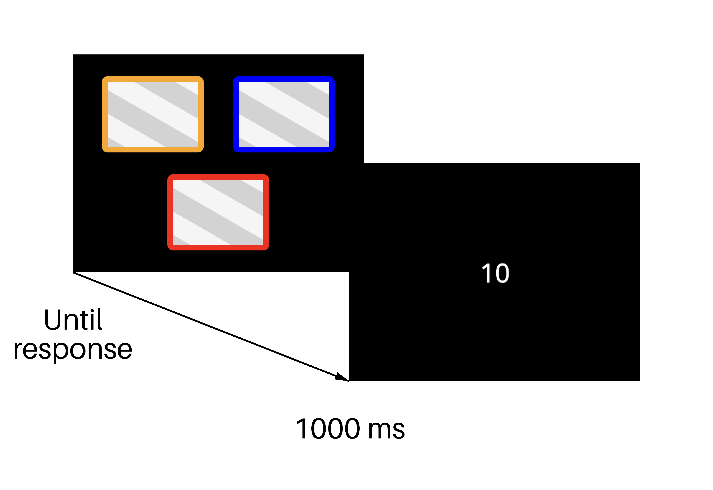

# Choice

A set of choices (can be html code or bandits) with values. The participant is asked to choose an option by clicking on it.

## Example: Bandit

A three-armed bandit task for reinforcement learning. The task is to choose between options, each with a different value.

